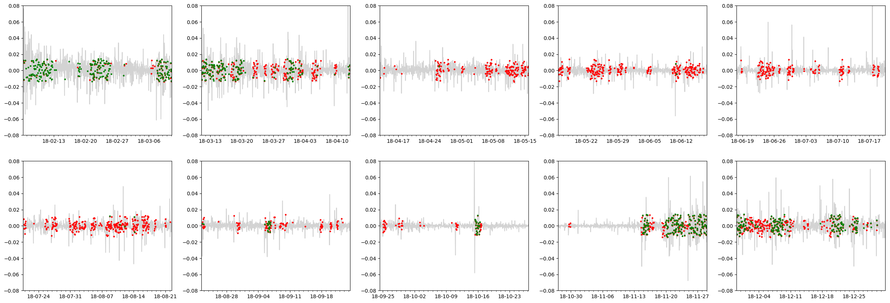
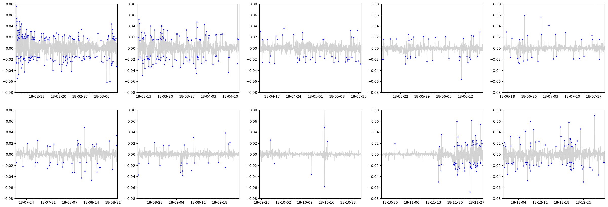

[](http://quantlet.de/)

## [](http://quantlet.de/) **MLvsGARCHcomp** [](http://quantlet.de/)

```yaml

Name of Quantlet: 'MLvsGARCHcomp'

Published in: 'Crypto volatility forecasting: ML vs GARCH'

Description: 'Compare models obtained from MLvsGARCHecon and MLvsGARCHml based on classification accuracy.'

Keywords: 'deep learning, recurrent neural network, LSTM, GARCH, econometrics, machine learning, realised volatility, volatility forecasting, cryptocurrency, btc'

Author: 'Bruno Spilak'

See also:
- MLvsGARCHml
- MLvsGARCHcomp

Submitted:  '12.07.2019'

Datafile: '`../data/btc_1H_20160101_20190101.csv`: candle price of btc with 1 hour frequency'

Input:  'The reader can modify the parameters of the model in each code file and config file.'

Output:
- plot_positive.png
- plot_TN.png
- plot_TP.png
- plot_FN.png
- plot_FP.png
- plot_TP_price.png

```







### PYTHON Code
```python

import sys
sys.path.append('../')
from MLvsGARCHml.core import load_data, get_total_roc_curve
from resultprocess import get_pred, get_cv_results, get_metrics, plot_class_results
import pandas as pd
import json
import numpy as np
import datetime as dt


# Load complete dataset and config

# Change path here
dl_model = "../MLvsGARCHml/saved_models/12072019-143851/"
model_epoch = 9
econ_model = "../MLvsGARCHecon/saved_models/20190712150215_FINAL/"

get_total_roc_curve(dir_=dl_model, epoch_number=model_epoch, fig_name = 'Total', legend = True)
    

# Change list of plots to produce
plots = ['positive', 'TN', 'TP', 'FN', 'FP', 'TP_price']

# leave untouched
global_dates = json.load(open("%s/global_dates.json" % dl_model, "r"))
config = json.load(open("%s/config.json" % dl_model, "r"))
pred = pd.read_csv("%s/cv0.csv" % econ_model, index_col = 0)
pred.index = pd.to_datetime(pred.index, unit = 's')
assert np.sum(pred.index != pd.to_datetime(global_dates['cv_0']['date_test'])) == 0
assert abs(config['label_param']['lowerBand']) == config['label_param']['upperBand']
threshold = config['label_param']['upperBand']

dfdata, target = load_data(path='../data/btc_1H_20160101_20190101.csv',
                           features=config['data_param']['features'],
                           **config['label_param'])
dfdata.dropna(inplace = True)
returns = dfdata[['ROCP_1']]
returns.columns = ['returns']
returns.index = returns.index - dt.timedelta(hours = 1) # reindex to match with signal indices
logreturns = np.log(returns + 1)

cv_split = config['cv_param']['cv_split']
n_classes = config['data_param']['n_classes']

results = get_cv_results(returns, dl_model, econ_model, threshold, cv_split, n_classes, model_epoch)

for type_ in plots:
    plot_class_results(results, type_, title=None, legend=False,savefig=True)


precision = pd.DataFrame()
precision['garch'] = [results[k]['metrics']['garch'][0] for k in results.keys()]
precision['lstm'] = [results[k]['metrics']['lstm'][0] for k in results.keys()]

recall = pd.DataFrame()
recall['garch'] = [results[k]['metrics']['garch'][1] for k in results.keys()]
recall['lstm'] = [results[k]['metrics']['lstm'][1] for k in results.keys()]

fmeasure = pd.DataFrame()
fmeasure['garch'] = [results[k]['metrics']['garch'][2] for k in results.keys()]
fmeasure['lstm'] = [results[k]['metrics']['lstm'][2] for k in results.keys()]


fpr = pd.DataFrame()
fpr['garch'] = [results[k]['metrics']['garch'][3] for k in results.keys()]
fpr['lstm'] = [results[k]['metrics']['lstm'][3] for k in results.keys()]

print(fmeasure.describe().round(2))
fmeasure.describe().round(2).to_csv('f_measure.csv')

print(recall.describe().round(2))
recall.describe().round(2).to_csv('recall.csv')

print(precision.describe().round(2))
precision.describe().round(2).to_csv('precision.csv')

```

automatically created on 2019-07-15