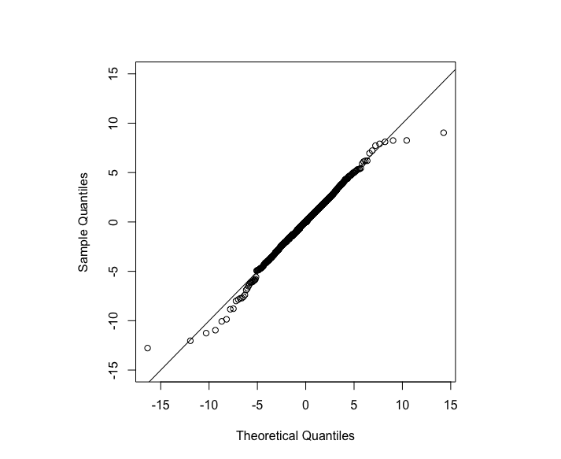

[](http://quantlet.de/)

## [](http://quantlet.de/) **MLvsGARCHecon** [](http://quantlet.de/)

```yaml

Name of Quantlet: 'MLvsGARCHecon'

Published in: 'Crypto volatility forecasting: ML vs GARCH'

Description: 'Do a first econometrics analysis of btc log returns following Chen et al (2017) in `MLvsGARCHecon_1.R`, then build a rolling forecast with selected model `MLvsGARCHecon_2.R`'

Keywords: 'econometrics, GARCH, EGARCH, volatility forecasting, realized volatility, cryptocurrency, btc'

Author: 'Bruno Spilak'

See also:
- MLvsGARCHml
- MLvsGARCHcomp
- econ-tgarch
- econ_arch
- econ_arima
- econ_ccgar
- econ_crix
- econ_garch
- econ_vola

Submitted:  '12.07.2019'

Datafile: '`../data/btc_1H_20160101_20190101.csv`: candle price of btc with 1 hour frequency'

Input:  'The reader can modify the parameters of the model in each code file.'

Output:
- btc_log_returns.png
- btc_qqplot.png
- btc_qqplot_estgarch.png
- saved_models

```





### R Code
```r

rm(list = ls(all = TRUE))
graphics.off()

# install and load packages
libraries = c( "rjson", "timeSeries")
lapply(libraries, function(x) if (!(x %in% installed.packages())) {
  install.packages(x)
})
lapply(libraries, library, quietly = TRUE, character.only = TRUE)

source('./core.R')

hour = 1
day = hour*24
week = day*7
month = week*4


####### data
ret = get_returns("../data/btc_1H_20160101_20190101.csv")

####### model parameters
distribution = 'sstd'
armaOrder = c(3, 1)
n_train = 6*month #length(ret$close[(ret$dates <=cv[1])])
comments = paste0('FINAL')

####### cross validation folds
cv <- fromJSON(file = "../MLvsGARCHml/saved_models/12072019-143851/global_dates.json")
nb_cv = length(cv)
####### Refit frequency of GARCH model
every = nb_cv

start_time_total <- Sys.time()
results = cv_prediction(ret, cv, armaOrder, distribution, every,
                        n_train = n_train, save = FALSE, comments = comments)
end_time_total <- Sys.time()
print('Total time:')
print(end_time_total - start_time_total)


```

automatically created on 2019-07-15