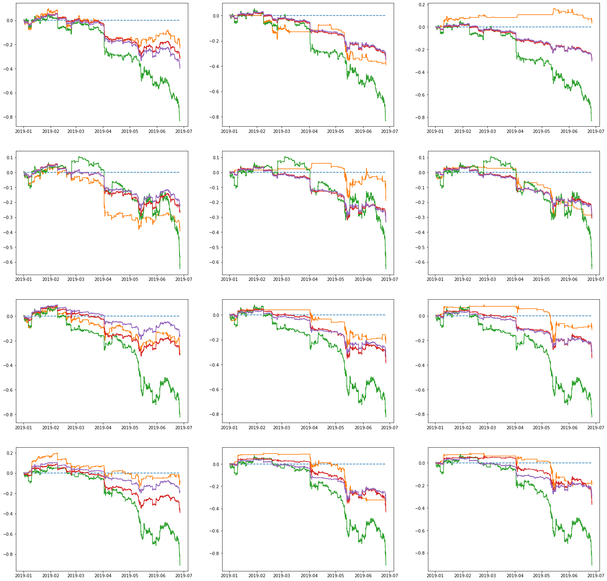
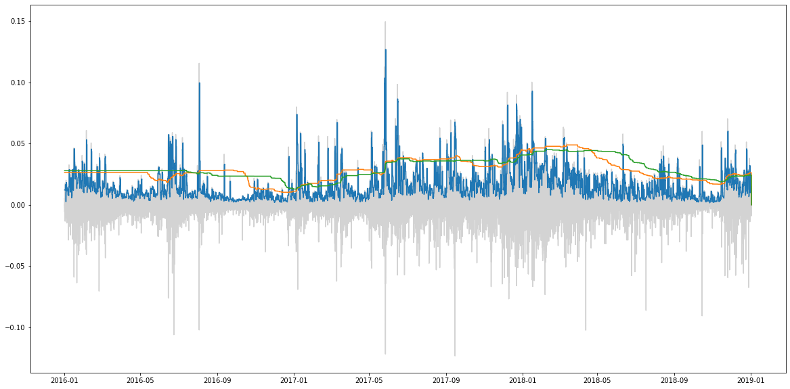

[](http://quantlet.de/)

## [](http://quantlet.de/) **MLvsGARCH** [](http://quantlet.de/)

```yaml

Name of Quantlet: 'MLvsGARCH'

Published in: 'Book: Encyclopedia of Finance. DOI : 10.1007/978-3-030-73443-5 Chapter Title : Tail-Risk Protection: Machine Learning Meets Modern Econometrics.'

Description: 'We provide results for "Tail-risk protection: Machine Learning meets modern Econometrics", Spilak, WK Härdle (2020). Please refer to README2.md for a detailed description on how to use the code.'

Keywords: 'tail-risk, trading strategy, cryptocurrency, Value-At-Risk, deep learning, machine learning, econometrics, extreme value theory, exceedance probability'

Author: 'Bruno Spilak'

```





