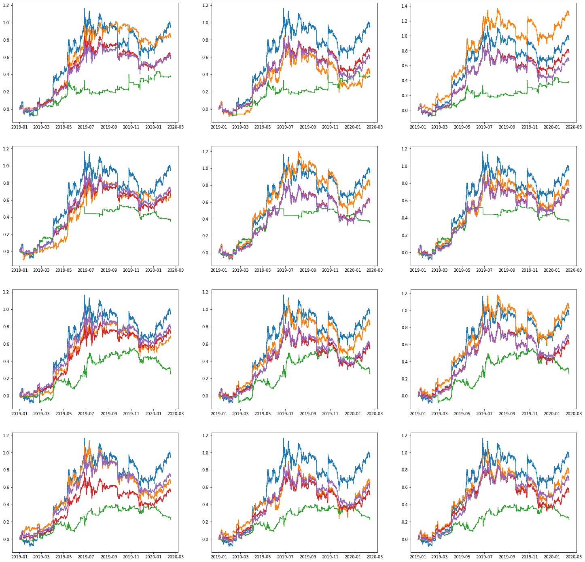
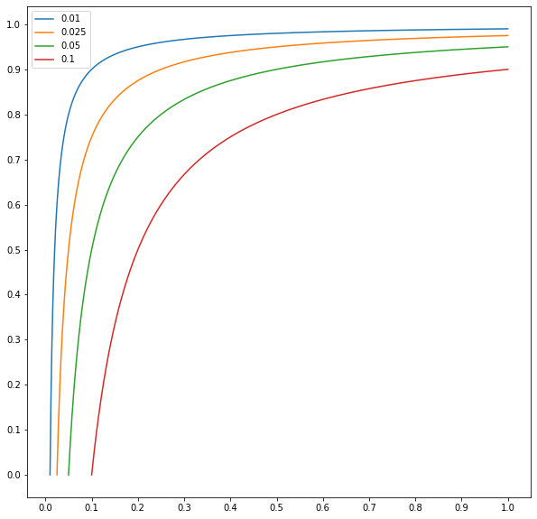

[](http://quantlet.de/index.php?p=info)

# Abstract of the work:
We provide results for "Tail-risk protection: Machine Learning meets modern Econometrics", Spilak, WK Härdle (2020).

# Installation:

To be able to run the python code, the user must install virutalenv (https://virtualenv.pypa.io/en/latest/installation/), create a virutal enviroment with python 3 and install the requirements:

```
pip install virtualenv
virtualenv -p python3 venv
source venv/bin/activate
pip install -r requirements.txt
```

# [](http://quantlet.de/) **[MLvsGARCHecon](MLvsGARCHecon)** [](http://quantlet.de/)


In this repo, we first do a time series analysis of btc log returns in order to find the best parameter following Box-Jengins method *(ARIMA(3,0,1)-EskewtGARCH(1,2)*).

Then, we build a rolling forecast on the validation set with a refit paramter. The user can modifiy the parameters directly in the code.


# Plots

We present here all plots in the paper, for example:

## Historical performance



## Constraints


