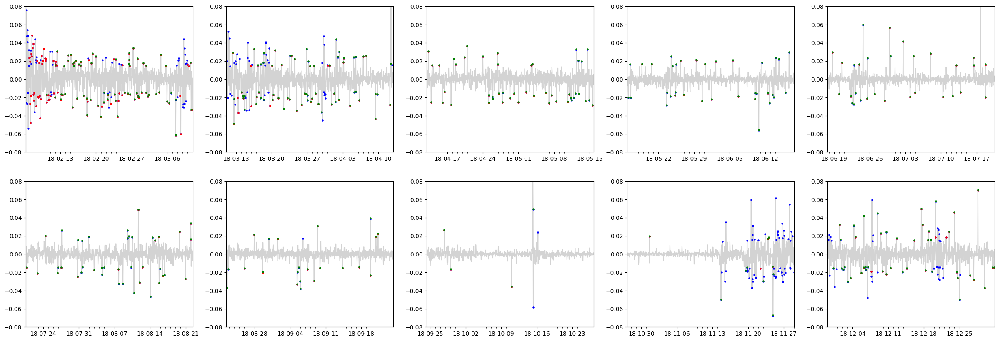
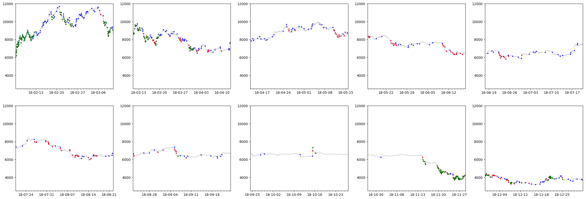

[](http://quantlet.de/index.php?p=info)

# Abstract of the work:
We provide code for "Crypto volatility forecasting: ML vs GARCH" paper.

# Installation:

To be able to run the python code, the user must install virutalenv (https://virtualenv.pypa.io/en/latest/installation/), create a virutal enviroment with python 3 and install the requirements:

```
pip install virtualenv
virtualenv -p python3 venv
source venv/bin/activate
pip install -r requirements.txt
```

#  **[MLvsGARCHecon](MLvsGARCHecon)**

In this repo, we first do a time series analysis of btc log returns in order to find the best parameter following Box-Jengins method *(ARIMA(3,0,1)-EskewtGARCH(1,2)*).

Then, we build a rolling forecast on the validaiton set with a refit paramter. The user can modifiy the parameters directly in the code.

#  **[MLvsGARCHml](MLvsGARCHml)**


In this repo, we train a recurrent neural network in a time-series cross-validation manner to verify robustness. The architecture is fixed and can be modified in `core.py` `Model().build_model()` method.

The user can modifiy the parameters directly in the code.


#  **[MLvsGARCHcomp](MLvsGARCHcomp)**

In this repo, we compare the results from the final GARCH and machine learning models based on classification accuracy.

Here you see some plots from this repository:


